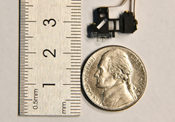
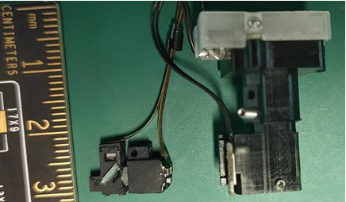
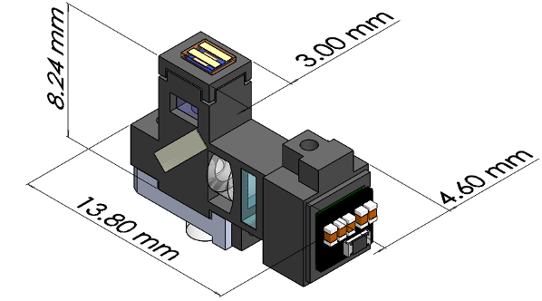

# TINIscope 

<!-- **Tightly integrated neuronal imaging fluorescence microscope** -->

<!--  -->

In this project repository, we introduce TINIscope, a **Tightly Integrated Neuronal Imaging microscope** optimized for electronic and opto-mechanical design. With its compact and lightweight design of 0.43 g, TINIscope enables unprecedented simultaneous imaging of behavior-relevant activity in up to four brain regions in mice. Moreover, TINIscope can be combined with additional modules to facilitate optogenetics, electrical stimulation, or local field potential recordings, allowing for multi-modal experimental design. Overall, TINIscope represents a timely and indispensable tool for studying the brain-wide interregional coordination that underlies unrestrained behaviors.

<!--  -->
<!--  
<!-- [!./assets/tiniscope_ruler.png](af) -->
<!--   -->
<!--  --> 

## Features

TINIscope features an ultra-compact size and an incredibly light weight, enabling the option to wear four of them on a single mouse. The key specifications are outlined below:

| Specications                | Value            |
| --------------------------- | ---------------- |
| Field of view(FOV)          | 450 × 450  μm    |
| Weight of single unit       | 0.43g            |
| Dimensions                  | 4.6×13.8×8.24 mm |
| Typical oprating frame rate | 40 Hz            |
| Optical resolution          | 2.2 μm           |
| Adjustment of focal range   | ~0-200 μm        |
| Cable length                | 50/70 cm         |

## Overview 
As standalone equipment, TINIscope reaches a new level of miniaturization in head-mounted microscopes, reducing the burden added to smaller or developing animals like juvenile songbirds. Based on the TINIscope design, we further systematically developed an experimental paradigm, including multi-site implantations and a commutator for wire untangling, for multi-region calcium imaging in freely behaving mice. 

In this repository, our goal is to present our work in the development of optics, electronics, and mechanics pertaining to various aspects of TINIscope. We cover topics such as the lightpath, housing, baseplate, commutator system, and provide useful guidelines for conducting experiments. To access detailed information regarding each topic, please click on the provided links below.
 
### [Part list](./TINIscope_Documents/PartList.md)

## Main contributors
* Feng Xue
* Fei Li 
* Ke-Ming Zhang 
* Pengcheng Zhou, zhoupc1988@gmail.com

## Declaration
[University of Science and Technology of China](https://www.ustc.edu.cn) has filed a patent application related to the design of TINIscope. 

## Acknowledgement 
* [MIniscope-v4](https://github.com/Aharoni-Lab/Miniscope-v4)
  * The UCLA miniscope team is a trailblazer in open-sourcing miniaturized microscope technologies. Their well-written and organized documentation has been a great inspiration for us to adopt similar styles when open-sourcing the development of our TINIscope.

## Copyright
* [University of Science and Technology of China 中国科学技术大学](https://www.ustc.edu.cn)
* [Xiongan Institute of Innovation 雄安创新研究院](http://xii.ac.cn/)
