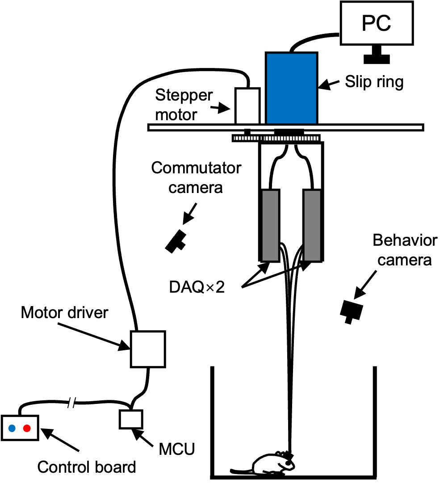
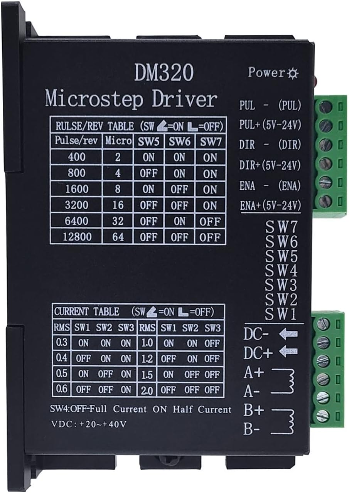
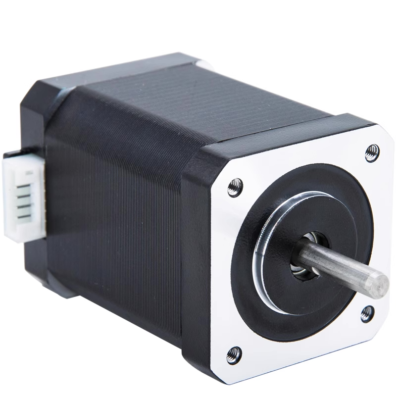
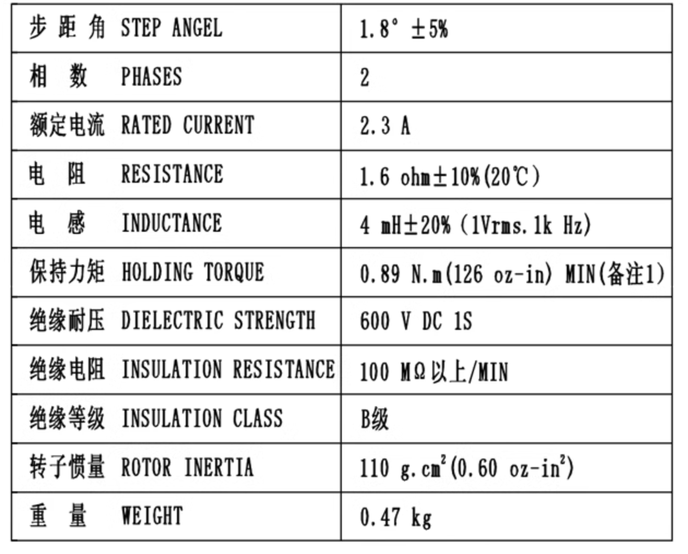
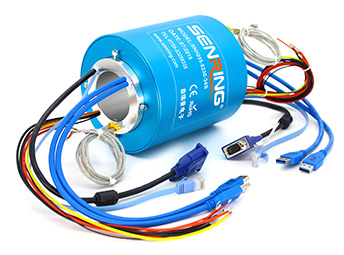
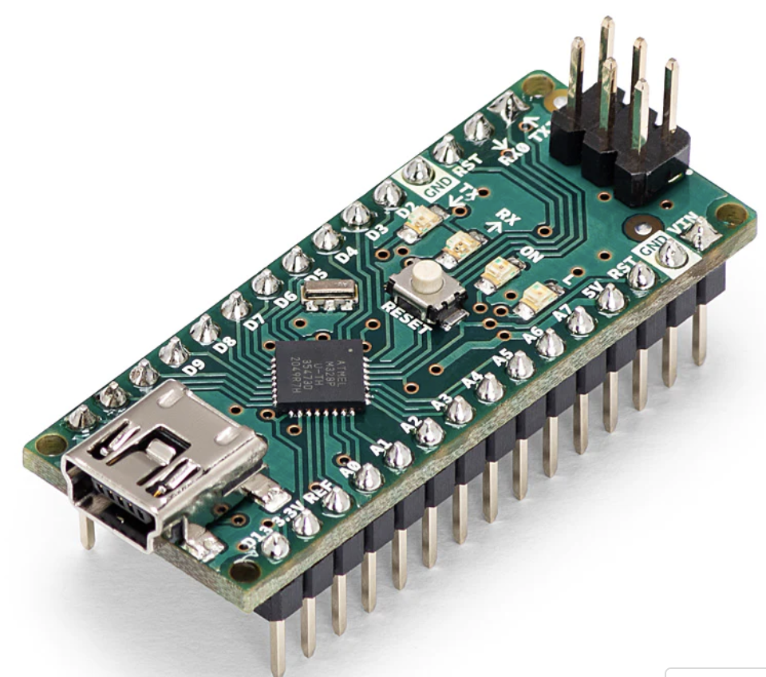
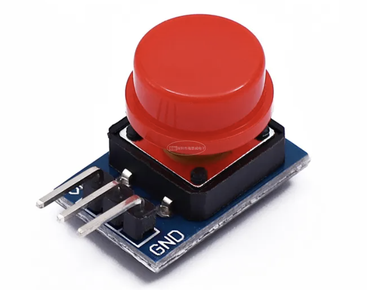

# Part list of commutator system 

The commutator employs a stepper motor to rotate an electrical slip ring and unravel any twisted cables according to their shapes monitored by a camera. 

<!-- DAQ boards were connected to a computer through a slip ring driven by a stepper motor, and the motor was manually controlled by the experimenter outside of the experimental room through the control board -->

<!-- Commutator design. The commutator was composed of a 3D-printed nylon U-shaped bracket, an electric slip ring (B1286-08S-4U-62641, Senring), a stepper motor (42B60, Taobao) with a driver (DM320, Taobao), and a controller (Arduino Nano, Supplementary. Two MIPI DAQ boards were mounted on the arms of the bracket, which was fixed to the rotor of the electric slip ring. The stepper motor was coupled to this rotor via a 1:2 gear set, providing the power to rotate the DAQ boards. During experiments, the experimenters determine the rotation direction by monitoring the shapes of flexible PCBs through a camera (Supplementary Figure 4A-C) and then press the controller to rotate the stepper motor clockwise or counterclockwise through the Arduino Nano, avoiding any movement-related wire entanglements. -->

## Part list 
### DAQ 

### control board 

## MCU 

### Motor driver 

[DM320 2H320 Stepper motor driver controller](https://www.electric-b2c.com/products/dm320-2h320-stepper-motor-driver-controller-pulse-12800-microstep-motor-brushless-dc-motor-shell-for-28-35-42-stepper-drivers)

Product features: 
1. supply voltage: DC12-36V or AC12-24V 
2. Drive current: 0.3-2.0A 
3. subdivision precision: 1-128 subdivision options
4. opto-isolated signal input 
5. motor noise optimization function 
6. can drive any 2.0A below current 2-phase or 4-phase hybrid stepper motor 
7. 200KHz chop frequency

For more specifications, check the 
[data sheet](https://cdn.shopifycdn.net/s/files/1/0583/0872/2881/files/DM320_2H320_Stepper_motor_driver_controller.pdf?v=1660788999).
### Stepper motor 

[ML42HB60 J-4218HB4401 42 Stepper motor High 60mm Torque 0 89Nm Motor](https://www.yoycart.com/Product/521600244151/)

### slip ring 

[BH1286 Series Industrial Bus Slip Rings](https://www.senring.com/industrial-bus/bh1286.html) 

**Features**:
 * hole size 12.7mm, OD 86mm,max. 96 circuits; 
 * accurately transmit high speed data 
 * stably transmit all kinds of signals, such as, RS-232, RS-485, RS-422, VGA, etc.; 
 * stably transmit all kinds of signals, such as, Profibus,LonWorks,CanBus,DeviceNet,ControlNet, etc.; 
 * transmit mixed signals, such as, USB,HDMI, 1000M ethernet, fiber optic, VGA, DVI, coaxial RF (high frequency), etc. 
 * stably transmit Ethernet data(10M / 100M / 1000M BaseT);

see more information form the [product catalog](https://www.senring.com/pdf/Senring-BH1286-Series-SlipRing-Catalog.pdf). 

### MCU 

[Ardonu Nano](https://store-usa.arduino.cc/products/arduino-nano?selectedStore=us)

The classic Arduino Nano is the smallest board to build your projects with.
Each of the 14 digital pins on the Nano can be used as an input or output, using pinMode(), digitalWrite(), and digitalRead() functions. They operate at 5 volts. Each pin can provide or receive a maximum of 40 mA and has an internal pull-up resistor (disconnected by default) of 20-50 kOhms. 

### control board 

The control board is composed of two switch button connecting to the MCU. 

### Commutator camera and behavior camera 

## Put them together 

Once you have acquired all the necessary components, assembling them is as straightforward as connecting them according to the diagram provided above. To give you a better idea of the final product, we have included a video demonstration below:

<!--  -->

<video src="../assets/virtual_simulation.mp4" controls title="commutator"></video>