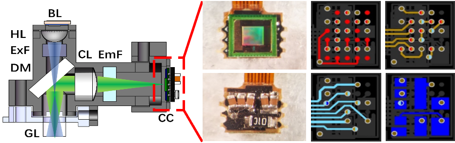

## Part list 

 <!-- For details on options of how to purchase/produce these components, go to the Part Procurement page of this wiki. -->

The core of TINIscope consists of a Rigid-Flex PCB, filter set, objective GRIN lens set, half-ball lens, and machined or printed housing, slider and baseplate. Below outlines the details of each of these components.

* BL: blue LED
* HL, half-ball lens
* ExF, excitation filter
* DM, dichroic mirror
* GL, GRIN objective lens
* CL, convex lens
* EmF, emission filter
* CC, CMOS camera.

<video src="../assets/tiniscope_parts.mp4" controls title="Title" width=400></video>
## Machined or Printer Parts 
The print and CNC files for the TINIscope housing and base plate can be found in the "TINIscope_Housing" folder of this repository. 

There are 3 parts 3D printed by the printer Form 2 from formlabs. The material is their normal blackresin. Form3 has also been tested to achieve better printing resolution with same material. The optional materials could be PU Rigid 1000/650 Resin, which are more durable from their description. However, these materials were unable to be purchased from our areas and therefore we did not test them.

The baseplate is CNC machined.

### Housing

The main housing of TINIscope fits all the optical parts. A intruction will help to illustrate how to assemble it with these optical parts, pleaase refer to the [Step-by-step assembly](./TINIscope_Documents/Assembly.md).
  

### Slider

The slider is used to fit the CMOS image sensor and mate with the housing to adjust the focal plane of TINIscope. A longer slider range could achieve wider adjustment range of focal palne. The slider has a hole to fit with with a M1 self-tapping screw, after the adjustment of focal plane is finished, the screw help to secure it with the housing.

### Led cap

The illumination path is highly dependent on the precise placement of hall ball lens and LED, so a led cap is utilized after the hall ball lens is placed right in the middle of the illumination path to keep the precise placement of LED.

### Led cap

The baseplate is CNC machined mainly due to consideration of keep durability of its 2 M1 screw thread. The hole to fit the GRIN objective lens should be as precise as possile to obtain good image quality.
  

## PCB 
The fabrication files for the TINIscope PCB can be found in the "TINIscope_PCB" folder of this repository. 

### Rigid-flex PCB 

A rigid-flex PCB is fabricated to connect the CMOS image sensor and DAQ board. The flex cable part is 50/70 cm to keep flexibility when the animal moves freely. The layer stack excel file should be strictly followed to simultaneously keep the stability of data transmission and the agility of animal.

The BOM is provided for the necessary components needed to be soldered on this PCB. After soldering them on PCB, 4 PCBs will be connected to 2 DAQ boards. These 2 DAQ boards will be then fixed on the 3D printed U-shape Bracekt.

### FPC for LED

## Optical filters 
